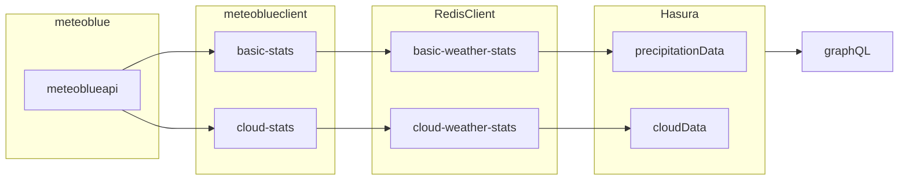

# Cloud Function for the Meteoblue API
This cloud function does some logic to get the next hour's weather data from meteoblue for the `basic` endpoint and the `clouds` endpoint.

See [here](https://docs.meteoblue.com/en/weather-apis/forecast-api/overview) for more info on the meteoblue API documentation.

## Notes
API keys need to be refreshed every year.

## Architecture
Planned architecture


## Deployment

First, build the typescript:

```
yarn build
```

The above command will create a `/dist` folder with the built Javascript.

Then, ensure your `gcloud` CLI is pointed at the correct GCP project and deploy the cloud function:

```
sh deploy.sh
```